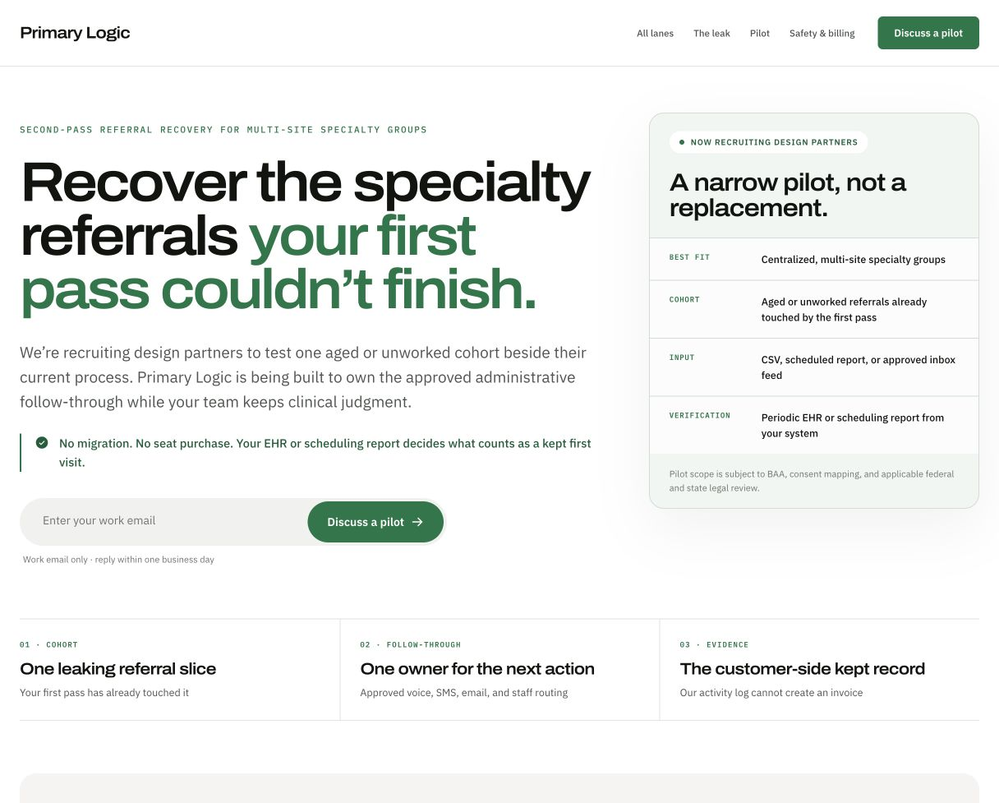
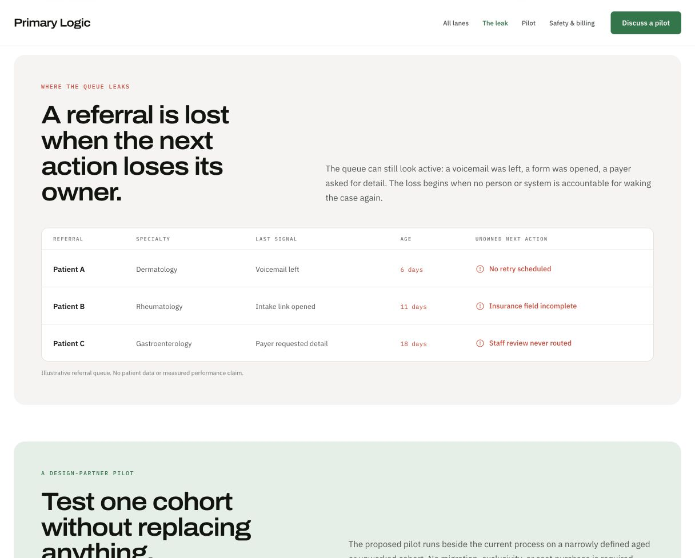
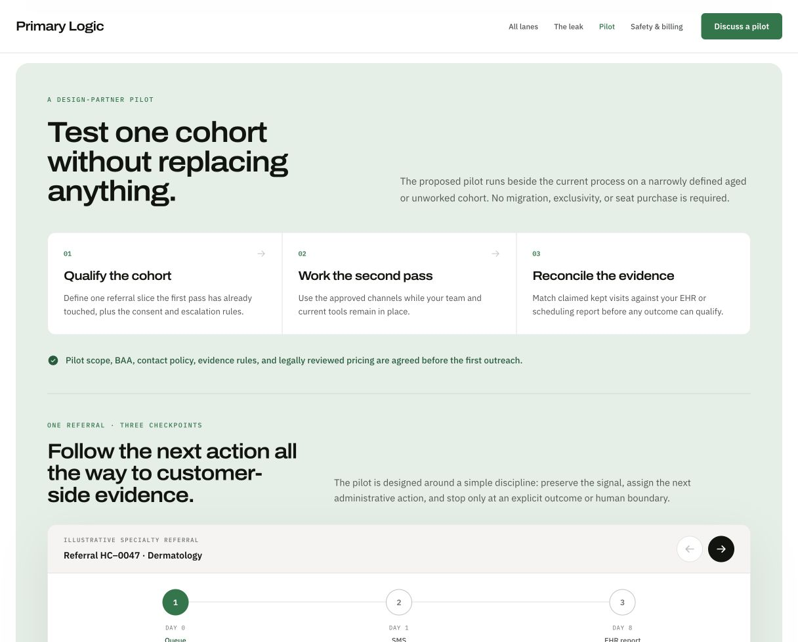
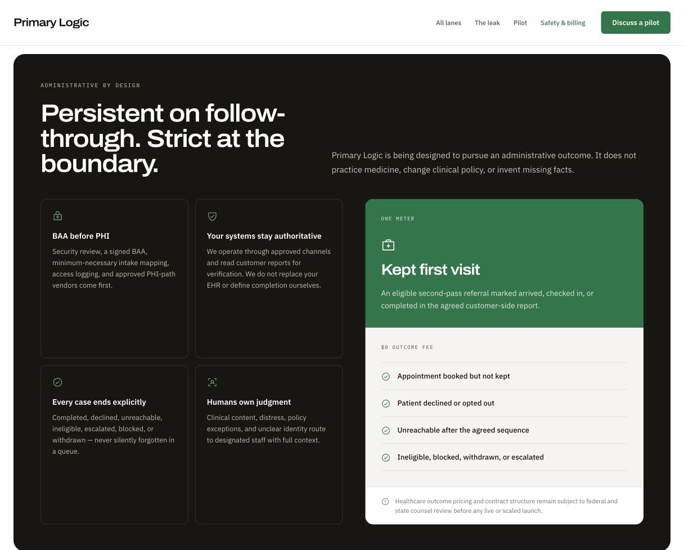
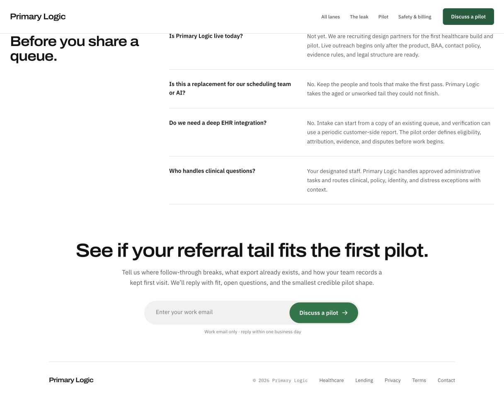
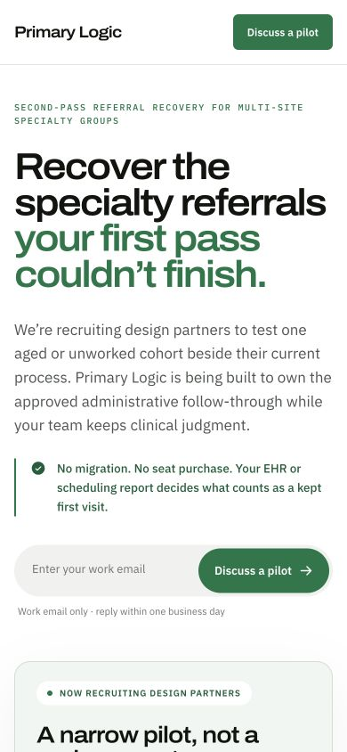

# Primary Logic healthcare landing-page audit

Date: 2026-08-14  
Scope: `/healthcare`, desktop and mobile hero plus the leak, pilot, safety/billing, and conversion sections.

## Overall verdict

The page is visually credible, unusually honest, and operationally clear. It still behaves more like a careful product memo than a demand-generating sales page. It over-invests in proving that Primary Logic will not disrupt the buyer and under-invests in why the referral tail is economically urgent, why this pilot is concrete, and why acting now is safer than accepting the status quo.

The dominant conversion problem is not polish. It is narrative sequence:

1. The page starts with product stage and operating caution.
2. It explains the leak without showing its economic consequence.
3. It repeats the low-risk pilot story.
4. It finally reaches outcome pricing and verification several sections later.

The strongest differentiator—pay only for customer-verified kept visits—should be part of the opening contract.

## Captured steps

### Step 1 — Hero and initial offer: visually healthy, commercially underpowered

Strengths:

- Clear specialty-group audience.
- Strong typography and restrained visual language.
- Honest pre-build wording.
- Customer-side verification and no-replacement posture reduce anxiety.

Risks:

- The right-hand pilot card repeats the left-hand explanation instead of demonstrating the handoff, evidence, or economics.
- “We’re recruiting design partners” centers Primary Logic’s stage before the buyer’s progress.
- “Your first pass couldn’t finish” may sound like criticism of staff or software the buyer already chose.
- The hero does not plainly say what a kept visit costs or that every other terminal state costs $0.
- “Discuss a pilot” describes the seller’s process, not the buyer’s next useful outcome.

Health: **Needs work**.

### Step 2 — Referral leak: clear diagnosis, weak urgency and proof

Strengths:

- “The next action loses its owner” is a strong operating insight.
- The table makes stalled work legible.

Risks:

- Patient A/B/C reads like synthetic dashboard data, and the disclaimer confirms that it is not proof.
- The table shows operational failure but not provider capacity, lost contribution value, competitive leakage, or referral-partner consequences.
- It shows the before-state only. A before/after next-action ledger would better demonstrate the change Primary Logic creates.

Health: **Healthy structure; weak persuasion**.

### Step 3 — Pilot and workflow: understandable, repetitive, underspecified

Strengths:

- The three-step pilot is understandable.
- The referral trace makes durable case ownership tangible.
- The process stays inside an administrative boundary.

Risks:

- “Not a replacement” has already been established several times.
- The buyer still cannot see cohort size, duration, fee or fee range, spend cap, weekly workload, recall rights, or stop/expand condition.
- The interactive trace explains mechanics but cannot substitute for proof.
- The workflow should appear within the first two viewport heights, not after repeated pilot framing.

Health: **Clear but incomplete**.

### Step 4 — Safety and billing: strategically strongest section, shown too late

Strengths:

- Strong distinction between administrative persistence and clinical judgment.
- Customer systems remain authoritative.
- Explicit terminal states and `$0` outcomes are persuasive.

Risks:

- The section still avoids the actual fee.
- Four guardrail cards make the buyer synthesize the boundary. A two-column authority map would be faster.
- Readiness proof is missing: BAA availability, PHI-path vendors, data-use policy, consent mechanics, duplicate suppression, escalation SLA, retention, and deletion.
- Small supporting text and labels should be tested for contrast and zoom resilience.

Health: **Strong idea; wrong placement and incomplete proof**.

### Step 5 — FAQ and conversion: clear endpoint, insufficient buying confidence

Strengths:

- Honest answer about current product stage.
- The final CTA frames a fit assessment rather than a generic demo.

Risks:

- The page asks for a pilot discussion without specifying what the buyer will receive after submitting.
- The FAQ answers basic positioning questions but not buying-committee diligence.
- Team credibility, exact pilot responsibility, attribution disputes, caller identity, buyer workload, and security readiness remain unanswered.

Health: **Clear but premature**.

### Mobile hero: readable, dense, and conversion-constrained

- The joined email/button control compresses both targets; stack them.
- The body, reassurance block, form, and pilot card create a text-heavy first screen without a visual payoff.
- Supporting labels and disclaimers reach 9–11px in several places.
- Referral-trace controls are 40px; target at least 44px.
- One secondary capture showed possible sticky-header overlap that was not reproduced consistently; treat it as a regression case to test across viewport sizes.

## Push–Pull–Anxiety–Habit diagnosis

| Force | Current page | What is missing |
|---|---|---|
| Push | Explains loss of next-action ownership | Trigger events, stranded provider capacity, backlog value, referral-partner and competitive consequences |
| Pull | No replacement, no seats, customer-side verification | Exact pilot terms, buyer workload, price, value model, reversible expansion path |
| Anxiety | Strong clinical boundary and EHR authority | Readiness proof, identity and consent controls, duplicate suppression, escalation SLA, data handling, attribution rules |
| Habit | Existing people and tools remain | Direct comparison with staff queues, campaigns, BPOs, broad automation, and accepting leakage |

The primary competitor is the buyer’s operating habit, not another AI vendor. The page should frame Primary Logic as overflow inventory recovery, not a replacement platform.

## Highest-impact changes

1. Put the economic contract in the hero: customer-verified kept visits are billable; everything else is `$0`.
2. Replace the duplicate pilot card with a second-pass handoff diagram.
3. Lead with a forcing event: new provider capacity, staffing loss, acquisition backlog, access KPI miss, or referral-partner complaint.
4. Change the CTA to `See if your backlog qualifies` or `Request a cohort-fit memo` and state the deliverable.
5. Publish specific pilot terms once validated: cohort, duration, fee/range, spend cap, weekly customer work, recall, reconciliation, and stop/expand rule.
6. Move customer-side reconciliation and invoice evidence immediately after the mechanism.
7. Replace synthetic proof with honest process proof: a sample evidence packet, inclusion rules, escalation record, customer recall control, and readiness checklist.
8. Build orthopedics- and GI-specific entry pages rather than forcing one generic specialty page to answer incompatible anxieties.
9. Compress repeated “not a replacement,” design-partner, and legal language.
10. Add a buyer-input value model without publishing an assumed recovery benchmark.

## Recommended page sequence

1. **Hero:** buyer, trigger, outcome, economic contract, qualification CTA.
2. **Compatibility strip:** keep staff, EHR, scheduler; start from an export; customer record decides billing.
3. **Leak and value:** failure modes plus buyer-entered backlog economics.
4. **Mechanism:** one referral, one named next action, one terminal state.
5. **Billing evidence:** schedule record → eligibility match → outcome invoice; `$0` non-billables.
6. **Alternatives:** internal queue, campaign, BPO, broad access automation, accepted leakage.
7. **Authority boundary:** what Primary Logic executes versus what staff must decide.
8. **Exact paid pilot:** you provide / we operate / your system verifies / expand or stop.
9. **Readiness and objections:** only questions not already answered visually.
10. **Conversion:** request the inputs required for a cohort-fit memo.

## Recommended diagrams

### 1. Second-pass handoff map

`Existing staff + scheduling tools → aged/unworked slice → Primary Logic persistence loop → terminal state → customer-side record`

Inside the loop: voice, SMS, email, payer/staff routing. Under terminal state:

- Kept first visit — billable.
- Declined — `$0`.
- Unreachable — `$0`.
- Ineligible or blocked — `$0`.
- Human escalation — `$0`.

### 2. Before/after next-action ledger

Before: last signal, age, no owner, no wake-up time.  
After: named owner, exact next action, wake-up time, evidence source.

Example transformation:

`Voicemail left · 6 days → Call Thursday at 4:30 PM · Primary Logic · source timestamp preserved`

### 3. Customer-side reconciliation

Place a customer schedule record beside Primary Logic’s eligible-cohort match and invoice evidence. Show muted `$0` rows underneath. This is the best early answer to billing anxiety.

### 4. Authority boundary

**Primary Logic may execute:** approved outreach, intake completion, administrative payer follow-up, scheduling, reminders, reconciliation.  
**Primary Logic must route:** clinical questions, policy exceptions, identity ambiguity, distress, missing clinical attestations.

### 5. Pilot contract strip

- **You provide:** eligible export, consent rules, escalation contacts.
- **We operate:** approved second-pass sequence beside the current workflow.
- **Your system verifies:** kept visits and the production-priced invoice.
- **Decision:** expand the cohort or stop after reconciliation.

## Replacement hero copy

Eyebrow:

> Referral-tail recovery for multi-site specialty groups

Headline:

> Turn referrals your current workflow has stopped working into customer-verified kept visits.

Body:

> Send one prequalified cohort after standard outreach is exhausted. Primary Logic follows every approved case across voice, SMS, email, and staff routing until it is kept, declined, unreachable, ineligible, or escalated. Your team keeps clinical judgment. Your schedule decides what is billable.

Economic line:

> Pay only for agreed kept first visits. Every other terminal state is `$0`.

CTA:

> See if your backlog qualifies

CTA helper:

> Share your specialty, approximate backlog, existing export, and kept-status field. We’ll return a cohort-fit memo within one business day.

Do not publish a cohort size, duration, fee, turnaround, or readiness claim until it is operationally approved.

## Claims and language to avoid

- Do not imply the product is live or proven while the specification remains pre-build.
- Do not call illustrative rows customer proof.
- Do not say every recovered visit is incremental without an agreed attribution rule.
- Do not publish a recovery rate or value multiple without measured evidence.
- Do not imply completed BAA, compliance, integration, security, or legal readiness before those facts are true.
- Do not attack the buyer’s EHR, staff, scheduling AI, or current process.

## Accessibility and evidence limits

The page has a skip link, semantic headings, table structure, labels, live form status, and labeled referral-trace controls. Screenshot/source review suggests risks from very small supporting text, 40px controls, the compressed mobile form, and the use of color as a strong status cue. Full keyboard behavior, screen-reader output, zoom/reflow, measured contrast, form error recovery, and complete WCAG compliance were not tested.

